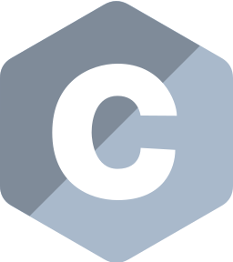

<p align="center">
  https://jahrei.github.io (unfinished 😔)
</p>

# jahrei. 👋🏼
+ love to tinker with computer hardware and software alike (jahrei labs) 💻🖥;⌨🖱
+ currently studying electrical / computer engineering ⚡️ 
+ spearheading the 1126 project, a personal self-improvement project 🔱⚓️
+ currently working software development & e-commerce management 💰{}


### fun facts about me 😎
* passionate in bodybuilding and powerlifting 💪🏼
* i'm an arch and gentoo daily driver user 🐧
* old apple computer and other vintage tech enthusiast 💾
* modern & retro video game enjoyer 🕹 

# my main focuses:
```
hardware: [
  proficiency in embedded systems;
  the relation between hardware and low-level languages such as Assembly and C
  power delivery; specifically hardware-level automation
] 

software: [
  software automation,
  mastering DevOps practices,
  Linux and Windows system administration,
  virtual machine solutions,
  website creation and deployment
]
```

# jahrei labs.


jahrei labs is a multidisciplinary sandbox of experimentation, research, and mastery - a personal RnD project, if you will. rooted in engineering, code, and creative power user workflows, jahrei labs exists to push the boundaries across software, embedded systems, reverse engineering, automation, AI, and digital preservation. 

nerd culture meets elite performance, with a touch of aesthetics.

## hardware.
<!-- TODO: Why not just compile a screencap of neofetch from each desktop? -->
`jahrei@kairos`: custom built i7-8700k /// RTX2070S /// GTX 1070Ti /// Gentoo Linux
> [main PC.](https://github.com/jahrei/kairos)
<table>
  <tr>
    <td align="center" width="86">
      <a href="#macropower-tech">
        
      </a>
      <br>gentoo.
    </td>
<!--     <td align="center" width="86">
      <a href="#macropower-tech">
        
      </a>
      <br>hyprland.
    </td> -->
    <td align="center" width="86">
      <a href="#macropower-tech">
        
      </a>
      <br>wayland.
    </td>
    <td align="center" width="86">
      <a href="#macropower-tech">
        
      </a>
      <br>vscodium.
    </td>
  </tr>
</table>


`jahrei@delabity`: custom built Ryzen 5 5600X /// AlmaLinux
> [homelab PC.](https://github.com/jahrei/delabity)

 <table>
    <tr>
      <td align="center" width="86">
        <a href="#section">
          
        </a>
        <br>
      </td>
      <td align="center" width="86">
        <a href="#section">
          
        </a>
        <br>
      </td>
      <td align="center" width="86">
        <a href="#section">
          
        </a>
        <br>
      </td>
      <td align="center" width="86">
        <a href="#section">
          
        </a>
        <br>
      </td>
      <td align="center" width="86">
        <a href="#section">
          
        </a>
        <br>
      </td>  
    </tr>
 </table>

`jahrei@glacier`: Lenovo Thinkpad T480 /// Fedora Linux
C / C++ / hardware development.


<table>
  <tr>
    <td align="center" width="86">
      <a href="#macropower-tech">
        
      </a>
      <br>
    </td>
    <td align="center" width="86">
      <a href="#macropower-tech">
        
      </a>
      <br>
    </td>
    <td align="center" width="86">
      <a href="#macropower-tech">
        
      </a>
      <br>
    </td>
    <td align="center" width="86">
      <a href="#macropower-tech">
        
      </a>
      <br>
    </td>
  </tr>
</table>

`jahrei@wakizashi`: Apple MacBook Air M1 2020, 16gb RAM /// macOS
webdev & education.
<!--
```
personal PC: kairos 

embedded dev: C lang / kicad / other stuff here

automation: python 

homelab / sysadmin: delabity / almalinux / docker / nginx / CodeLlama 34b

webdev: stuff
```
--!>
<!-- table code taken from MacroPower -->
<!--
<table>
  <tr>
    <td align="center" width="96">
      <a href="#macropower-tech">
        
      </a>
      <br>C
    </td>
    <td align="center" width="96">
      <a href="#macropower-tech">
        
      </a>
      <br>Python
    </td>
    <td align="center" width="96">
      <a href="#macropower-tech">
        
      </a>
      <br>Jsonnet
    </td>
    <td align="center" width="96">
      <a href="#macropower-tech">
        
      </a>
      <br>TypeScript
    </td>
    <td align="center" width="96">
      <a href="#macropower-tech" >
        
      </a>
      <br>Kubernetes
    </td>
    <td align="center" width="96"> 
      <a href="#macropower-tech" >
        
      </a>
      <br>Docker
    </td>
    <td align="center"  width="96">
      <a href="#macropower-tech">
        
      </a>
      <br>Debian
    </td>
    <td align="center" width="96">
      <a href="#macropower-tech" >
        
      </a>
      <br>Grafana
    </td>
  </tr>
</table>
-->


